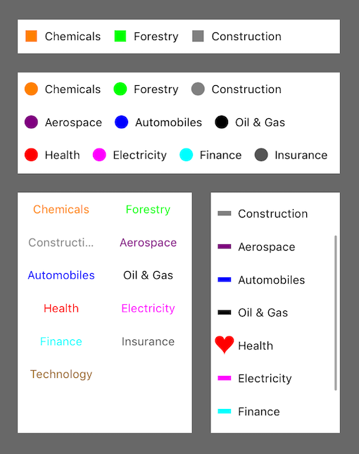
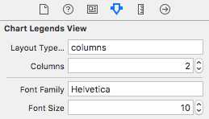

# ChartLegends

[](http://cocoadocs.org/docsets/ChartLegends)

Powerful customizable chart legends

Swift 3.0, iOS 8+



## Features:
- Configurable flow and column layouts.
- Predefined shapes and possibility to use custom paths.
- Per-cell configuration or overrides, e.g. to set a different font or shape than other cells.
- Custom views via `UICollectionView` subclasses.
- Autolayout support, configurable in Interface Builder.
- Interactive
- Scrollable
- Compatible with any chart type or library.

## Installation

#### CocoaPods

Add to your Podfile:

```ruby
use_frameworks!
pod 'ChartLegends'
```

## Quickstart

Simply:

```swift
@IBOutlet weak var legendsView: ChartLegendsView!

legendsView.setLegends(
	(text: "Chemicals", color: UIColor.orange),
    (text: "Forestry", color: UIColor.green)
)
```

## Usage

### Predefined legend types

ChartLegends currently supports these types out of the box:

#### Plain text
Displays text in the given color. The example in the quick start section produces this kind of legends.

#### Shape with text
Displays text with a shape on the left side, with given color. Here, also, there are some predefined options, for example circle, with a specified radius, or rect, with specified width and height.

For example, to use legends with a small colored circle on the left:
```swift
legendsView.setLegends(.circle(radius: 7), [
	(text: "Chemicals", color: UIColor.orange),
    (text: "Forestry", color: UIColor.green)
)]
```

If you want to show a shape that's not in the predefined types, you also can provide a path. Example:
```swift
let pathGenerator = {(size: CGSize) in
    return UIBezierPath()
}
legendsView.setLegends(pathGenerator, [
	(text: "Chemicals", color: UIColor.orange),
    (text: "Forestry", color: UIColor.green)
)]
```

Of course the idea is to expand the predefined types to support all possible regularly used paths. Don't hesitate to make a pull request with your path if you think it's of common interest!

### Custom cells

If you need more customization, you can also use custom cells. Example:

```swift
legendsView.configure(cellType: MyCustomCell.self) {cell, legend, indexPath in
	cell.label.text = legend.text
	// other custom configuration
}
```
This is type safe and concise - we don't need casting or delegates to configure the cell.

To implement a custom cell, you only have to extend `UICollectionViewCell` and conform to `ChartLegendCell` to add some additional functionality that `ChartLegendsView` needs to interact with the cell.

Here, again, feel free to submit a pull request with your cells, if you think they can be of common use.


### Layout types

You can configure the layout of `ChartLegendsView`, together with some other settings, directly in interface builder:



#### Options:

- `flowLeft`: Left aligned flow layout. This should be the most commonly used horizontal legends layout. 

- `columns`: Column layout - you can specify the number of columns in the "Columns field".

- `flow`: The default flow collection view layout, which will "justify" cells in order to occupy available space.


Note that when layout type is not set to `columns`, the Columns field is ignored.

## Demo

Download this repo and run the demo target!

## Lookout

Besides of adding new shapes and cells, there are surely several settings and refinements that can be done. Also, add animations!

## Contributing

1. Fork
2. Commit changes to a branch in your fork
3. Push your code and make a pull request

## Created By:

Ivan Schütz

## License

SwiftCharts is Copyright (c) 2017 Ivan Schütz and released as open source under the attached [Apache 2.0 license](LICENSE).

THE SOFTWARE IS PROVIDED "AS IS", WITHOUT WARRANTY OF ANY KIND,
EXPRESS OR IMPLIED, INCLUDING BUT NOT LIMITED TO THE WARRANTIES OF
MERCHANTABILITY, FITNESS FOR A PARTICULAR PURPOSE AND NONINFRINGEMENT.
IN NO EVENT SHALL THE AUTHORS BE LIABLE FOR ANY CLAIM, DAMAGES OR
OTHER LIABILITY, WHETHER IN AN ACTION OF CONTRACT, TORT OR OTHERWISE,
ARISING FROM, OUT OF OR IN CONNECTION WITH THE SOFTWARE OR THE USE OR
OTHER DEALINGS IN THE SOFTWARE.

